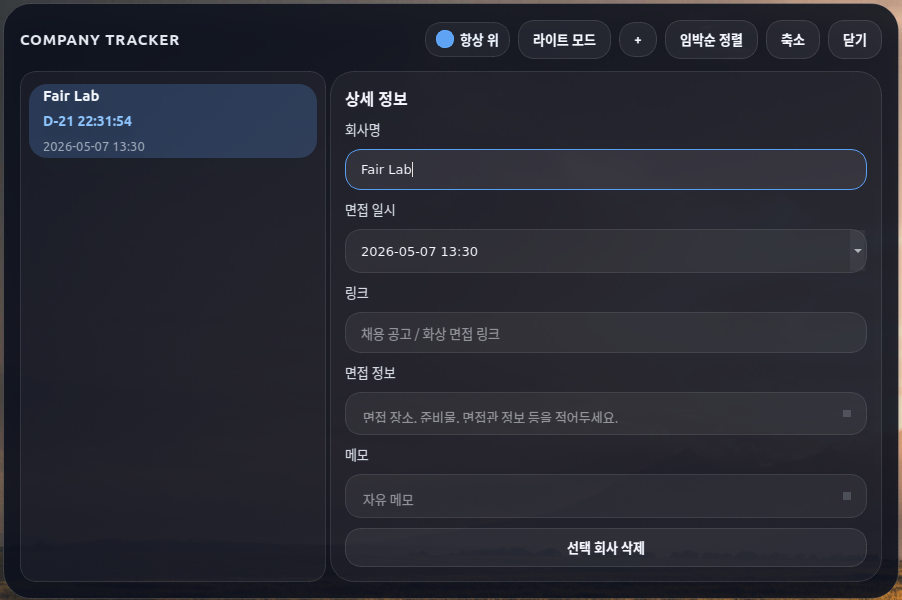
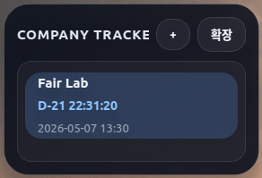

# Company Tracker

[한국어](README.ko.md) | [English](README.en.md)

A Windows desktop interview schedule widget built with PyQt6.

It starts as a compact floating widget for checking interview D-Day countdowns, and expands into a detailed view where you can manage notes, interview details, and related links for each company.

## Preview

### Collapsed Mode



### Expanded Mode



## Features

- Compact widget mode with company countdown list
- Expandable detail view for company notes
- Real-time D-Day countdown with seconds
- Add / delete companies
- Drag-and-drop ordering
- Auto-sort by nearest interview date
- Frameless movable window
- Always-on-top option
- Light / dark mode toggle
- Local JSON persistence
- Windows `.exe` packaging scripts included

## Tech Stack

- Python 3.x
- PyQt6
- Local JSON storage
- PyInstaller

## Project Structure

```text
app.py
requirements.txt
build_windows.bat
build_windows.ps1
README.md
README.ko.md
README.en.md
README_WINDOWS_BUILD.md
scripts/
  generate_icon.py
dday_data.example.json
image.png
image2.png
```

## Run Locally

### Linux / macOS

```bash
python3 -m venv .venv
source .venv/bin/activate
pip install -r requirements.txt
python app.py
```

### Windows

```powershell
python -m venv .venv
.venv\Scripts\Activate.ps1
pip install -r requirements.txt
python app.py
```

## Build Windows exe

Run one of the following on Windows:

```powershell
build_windows.bat
```

or

```powershell
.\build_windows.ps1
```

After the build finishes, the executable will be created at:

```text
dist\CompanyTracker\CompanyTracker.exe
```

Additional packaging notes are in [README_WINDOWS_BUILD.md](README_WINDOWS_BUILD.md).

## Data File

Runtime data is stored in `dday_data.json`.

- `dday_data.json` is ignored by git.
- `dday_data.example.json` is included as a safe sample file.

## Git Upload Notes

The following are already excluded via `.gitignore`:

- `.venv/`
- `__pycache__/`
- `dist/`
- `build/`
- `assets/`
- `dday_data.json`
